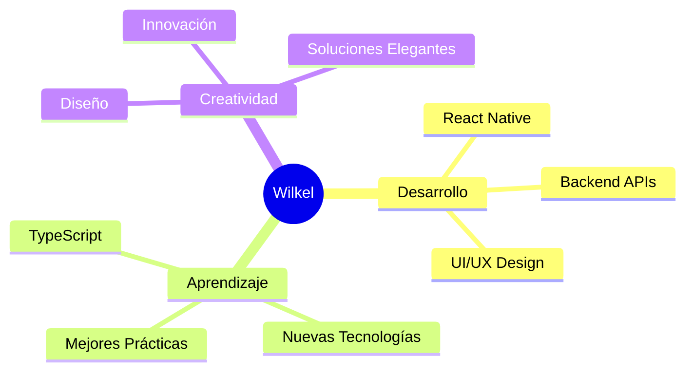

# ¡Hola! 👋 Soy Wilkel Mateo

<div align="center">
  
</div>

<div align="center">
  
</div>

## 🚀 Sobre mí

```javascript
const wilkel = {
  name: "Wilkel Mateo",
  role: "Full Stack Developer",
  location: "República Dominicana 🇩🇴",
  currentFocus: "React Native & Backend Development",
  technologies: {
    frontend: ["React", "React Native", "HTML5", "CSS3", "JavaScript"],
    backend: ["Node.js", "Express", "API REST"],
    tools: ["Git", "GitHub", "Figma", "VS Code"],
    databases: ["MongoDB", "MySQL"],
    learning: ["TypeScript", "Next.js", "React Native"]
  },
  contact: "wilkelmateo@gmail.com",
  motto: "Código limpio, soluciones creativas 💡"
};
```

## 🛠️ Stack Tecnológico

<div align="center">

### Frontend


### Backend & Databases


### Herramientas


</div>

## 📊 Estadísticas de GitHub

<div align="center">
  
  
</div>

<div align="center">
  
</div>

## 🎯 Proyectos Destacados

<div align="center">

### 🌟 Próximamente
*Trabajando en proyectos increíbles que pronto estarán disponibles*


</div>

## 📈 Actividad de Desarrollo

<div align="center">
  
</div>

## 🎨 Intereses y Pasiones

<div align="center">



</div>

## 🌐 Conéctate Conmigo

<div align="center">

[](mailto:wilkelmateo@gmail.com)
[](https://github.com/wil123-ai)
[](https://linkedin.com/in/wilkelmateo)

</div>

---

<div align="center">
  
  
  **"El código es poesía, y cada línea cuenta una historia"**
  
  
</div>

<div align="center">
  
</div>
